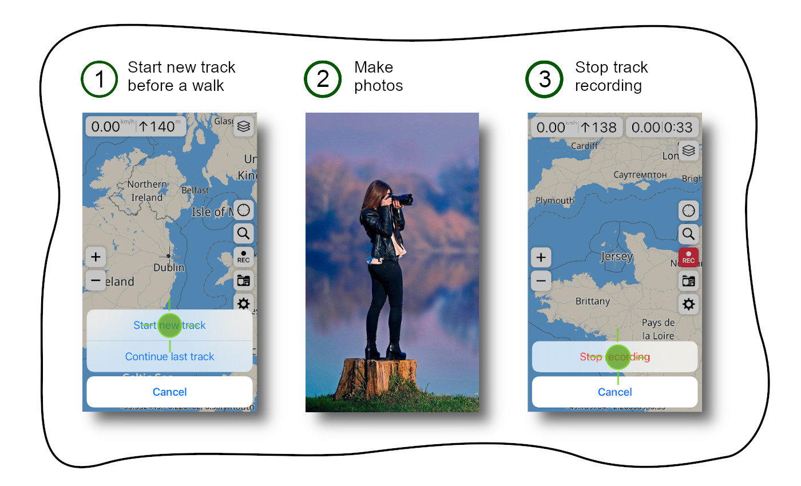
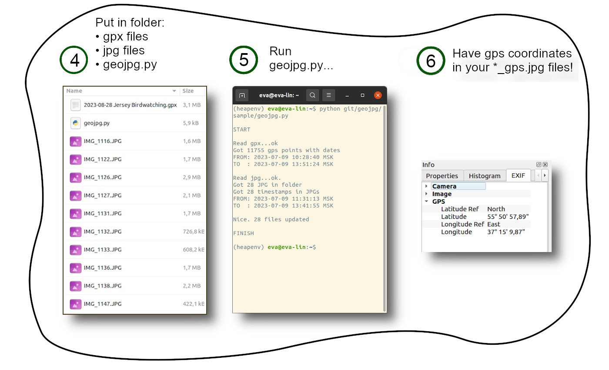

# geojpg
Small utility to insert **gpx** geodata to **jpg** files.  
Helpful when your DSLR camera **have no gps**, but your phone **have**. 

## How it works

## What you need to use geojpg

* Libraries **piexif** and **pandas** in your python environment  
* Your phone and camera must be **time-synchronized**

## Todo-list

[ - ] Get off pandas from code  
[ - ] Get off 'MSK' stamp in output and use GMT only  
[ - ] Earth hemispheres detecting  
note: now North and East are hard-coded  
[ - ] One-digit deegree support in longtitude/lattitude  
[ - ] App for Windows/Mac/Linux  
[ - ] Parameter for copy/rewrite jpg files  